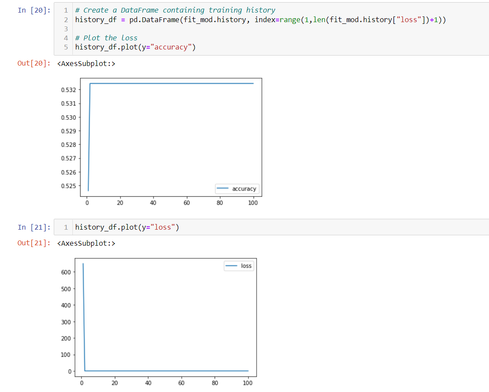
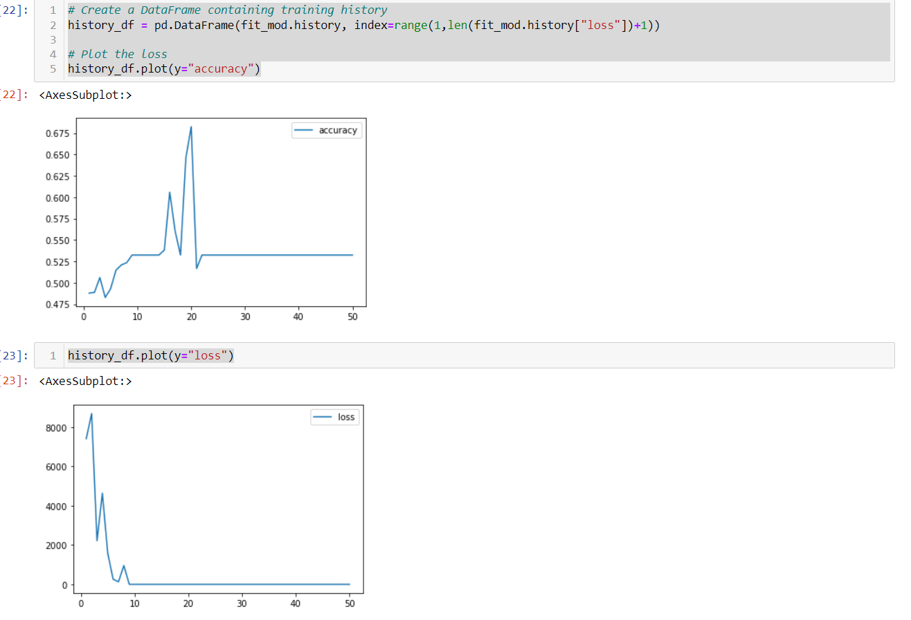
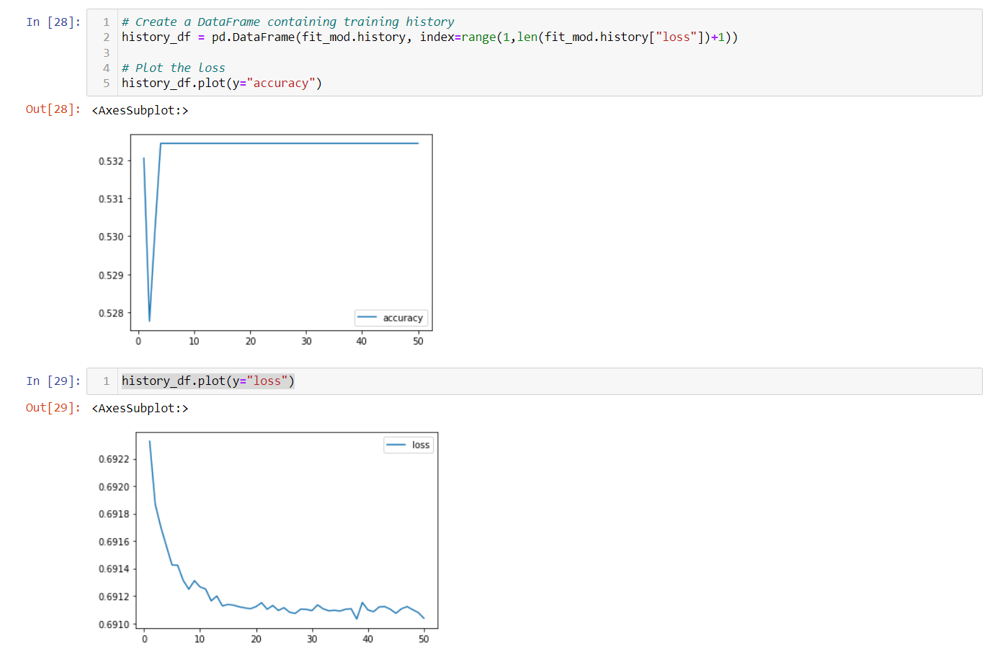
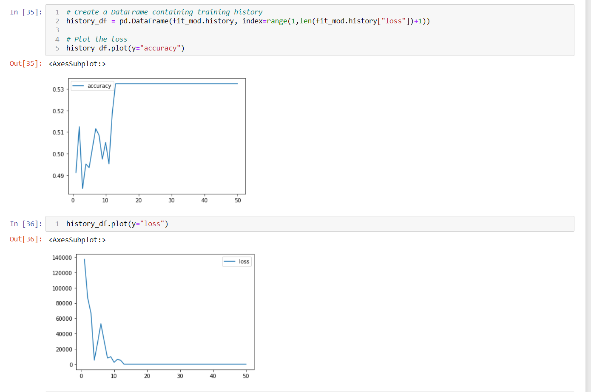

# AlphabetSoupCharity

## Overview 
This project is help AlphabetSoupe, a company that is funding charity, build a neural network model that will optimize financing projects. Alphabetsoupe wants those projects to be successful and they have historical data that has many attributes. However, some of those attributes like name and EIN does not help predict success ration and unique to each company therefore those table were dropped. 

## Results 

### Original

On my original trial I used two layers with 8 for first and five for second and ReLU for all activation functions. Accuracy for this model was 0.594. 

### Optimizations
I reduced number of epochs to 50 as there were no improvement in the models after 20+ epochs. 

#### Attempt 1 

To optimize the model, I double the number of neurons and added a layer (16, 10, 10). The result was significantly better with .719 accuracy. 

#### Attempt 2

increased number of neurons from attempt 1 to 40, 20, and 20 and change the activation for layer 1 to "sigmoid" function. This time results were worse than original attempt. 

#### Attempt 3

Finally, changed back the layer 1 activation to "ReLU", deleted layer 3 and further increased number of neurons to 100 and 80. It did increase accuracy to .617. However, model one is the best model so far in this trial. 

## Summary 
I found that increasing number of neurons or layers doesn't always help when building a neural network. For this issue I found three layers with 40,20,20 and neurons to be optimal.  
